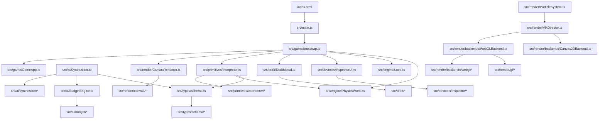

# Luna PvP Prototype — Architecture

> Living architecture reference for humans and AI agents.  
> Last updated: Plans 1–6 modularization complete. See also [`REFACTOR_SUMMARY.md`](REFACTOR_SUMMARY.md) and [`OVERHAUL_MAP.md`](OVERHAUL_MAP.md).

---

## System Overview

**Luna PvP Prototype** (`luna-pvp-prototype-v1`) is a browser-based hex-arena PvP spell combat prototype built with **Vite + TypeScript**. Abilities are not hardcoded — they are **`AbilitySchema` JSON documents** validated at load time, scored/balanced by the budget engine, authored by an LLM Spell Forger, and executed at runtime by a data-driven interpreter.

**Core data flow:** JSON spell schema → validate/sanitize/balance → player casts via input profiles → `Interpreter` dispatches triggers/actions → `PhysicsWorld` simulates entities → `CanvasRenderer` + WebGL VFX render the match.

**Current state (~141 `src/` files):** Six refactor-only plans (Plans 1–6) split former 600–2,500+ line monoliths into focused modules while **preserving every public import path** via barrel/shell entry files. Five headless regression harnesses guard schema scores, offline generators, interpreter casts, settings clamps, and render helpers. No CI pipeline yet.

**Entry point:** [`index.html`](index.html) loads [`src/main.ts`](src/main.ts) → [`src/game/bootstrap.ts`](src/game/bootstrap.ts) → [`src/game/GameApp.ts`](src/game/GameApp.ts).

---

## AI Context & Planning Rules

> **Read this section before drafting any implementation plan.** These rules are non-negotiable unless the user explicitly requests an architectural change.

### Core Design Principles

1. **Barrel / Shell / Impl pattern**
   - **Barrel** — thin re-export at the original import path (e.g. [`src/types/schema.ts`](src/types/schema.ts), [`src/ai/BudgetEngine.ts`](src/ai/BudgetEngine.ts), [`src/ai/Synthesizer.ts`](src/ai/Synthesizer.ts), [`src/primitives/Interpreter.ts`](src/primitives/Interpreter.ts)).
   - **Shell** — public class that delegates to helpers (e.g. [`src/render/CanvasRenderer.ts`](src/render/CanvasRenderer.ts), [`src/render/backends/WebGLBackend.ts`](src/render/backends/WebGLBackend.ts), [`src/draft/DraftModal.ts`](src/draft/DraftModal.ts), [`src/devtools/InspectorUI.ts`](src/devtools/InspectorUI.ts), [`src/render/ParticleSystem.ts`](src/render/ParticleSystem.ts)).
   - **Impl** — internal modules under subdirectories; consumers must **not** import these directly.

2. **Import-path stability**
   - Existing paths (`from '../types/schema'`, `from './ai/BudgetEngine'`, `from './primitives/Interpreter'`, etc.) must continue to resolve to barrel/shell entry files.
   - [`index.html`](index.html) must keep loading [`/src/main.ts`](src/main.ts).
   - **Do not** introduce new public import paths for code that belongs inside an existing barrel/shell domain.

3. **Move-only refactors by default**
   - Extract logic verbatim; replace module globals with explicit parameters (e.g. `app: GameApp`).
   - **Do not** change dispatch order, VFX recipes, scoring formulas, UI copy, or game behavior during refactor tasks unless explicitly requested.

4. **Regression gates are mandatory**
   - Every plan must pass the full acceptance gate before merge (see Testing section).
   - Add or extend headless harnesses (`tsx` in [`scripts/`](scripts/)) for risky extractions; no browser/Playwright tests unless requested.

5. **Settings deduplication**
   - Shared `localStorage` keys live in [`src/game/settings.ts`](src/game/settings.ts). Do not duplicate arena/combatant/cooldown keys in UI modules.

6. **Game state container**
   - Module-level globals are forbidden. New game-loop code receives [`src/game/GameApp.ts`](src/game/GameApp.ts) explicitly.

7. **The contract is JSON**
   - `triggers[]` = what happens; `trajectory` = motion; `inputProfile`/`resourceCost` = casting; `visuals` = appearance. Schema changes must update validators ([`src/types/schema/validators/`](src/types/schema/validators/)), sanitizers ([`src/ai/budget/sanitize/`](src/ai/budget/sanitize/)), interpreter ([`src/primitives/interpreter/`](src/primitives/interpreter/)), and VFX ([`src/render/backends/webgl/`](src/render/backends/webgl/)) in sync.

8. **Slot categories are non-runtime**
   - `PRIMARY`, `SECONDARY`, `UTILITY`, `ULTIMATE`, `MOBILITY` ([`src/types/cards.ts`](src/types/cards.ts)) affect AI compilation, balancing, and UI only — not interpreter behavior.

### Planning Checklist for AI Agents

- [ ] Identify the owning Barrel/Shell for the domain being changed
- [ ] Place new logic in Impl modules; re-export through the barrel/shell if public API needed
- [ ] Run full acceptance gate (`tsc`, all five `test:*` scripts, `build`)
- [ ] Update snapshots only when behavior intentionally changes
- [ ] Update this file and [`OVERHAUL_MAP.md`](OVERHAUL_MAP.md) if module layout changes

---

## Module Map & File References

### Public API Boundary

| Path | Layer | Role |
|---|---|---|
| [`src/main.ts`](src/main.ts) | Entry | Vite entry: `startGame()` |
| [`src/types/schema.ts`](src/types/schema.ts) | Barrel | Types, constants, `validateAbilitySchema()` |
| [`src/ai/BudgetEngine.ts`](src/ai/BudgetEngine.ts) | Barrel | Sanitize, score, balance, repair |
| [`src/ai/Synthesizer.ts`](src/ai/Synthesizer.ts) | Barrel | LLM + offline synthesis facade |
| [`src/primitives/Interpreter.ts`](src/primitives/Interpreter.ts) | Barrel | `Interpreter`, `buildTriggerMap` |
| [`src/render/CanvasRenderer.ts`](src/render/CanvasRenderer.ts) | Shell | Canvas world `render()` orchestration |
| [`src/render/ParticleSystem.ts`](src/render/ParticleSystem.ts) | Shell | VFX facade → `VfxDirector` |
| [`src/render/backends/WebGLBackend.ts`](src/render/backends/WebGLBackend.ts) | Shell | WebGL2 particle backend lifecycle |
| [`src/draft/DraftModal.ts`](src/draft/DraftModal.ts) | Shell | Spell Forger workshop UI |
| [`src/devtools/InspectorUI.ts`](src/devtools/InspectorUI.ts) | Shell | F1 inspector tabs and telemetry |

Everything below is **private implementation** unless re-exported through a barrel/shell above.

---

### Config & Root

| File | Role |
|---|---|
| [`index.html`](index.html) | Canvas z-index layering (`#game-canvas`, `#inspector-root`) |
| [`package.json`](package.json) | Vite/TS scripts and devDependencies |
| [`tsconfig.json`](tsconfig.json) | Strict ES2022 / ESNext module config |

---

### Types & Schema

| File | Role |
|---|---|
| [`src/types/schema/types.ts`](src/types/schema/types.ts) | `AbilitySchema`, trigger/action/condition types, `VisualDescriptor` |
| [`src/types/schema/constants.ts`](src/types/schema/constants.ts) | `TRIGGER_TYPES`, `ACTION_TYPES`, enum constants |
| [`src/types/schema/validators/ability.ts`](src/types/schema/validators/ability.ts) | Top-level `validateAbilitySchema()` |
| [`src/types/schema/validators/action.ts`](src/types/schema/validators/action.ts) | Action payload validation |
| [`src/types/schema/validators/trigger.ts`](src/types/schema/validators/trigger.ts) | Trigger node validation |
| [`src/types/schema/validators/trajectory.ts`](src/types/schema/validators/trajectory.ts) | Trajectory config validation |
| [`src/types/schema/validators/field.ts`](src/types/schema/validators/field.ts) | Field zone validation |
| [`src/types/schema/validators/condition.ts`](src/types/schema/validators/condition.ts) | Condition validation |
| [`src/types/schema/validators/constraint.ts`](src/types/schema/validators/constraint.ts) | Constraint joint validation |
| [`src/types/schema/validators/emitter.ts`](src/types/schema/validators/emitter.ts) | Emitter pattern validation |
| [`src/types/schema/validators/obstacle.ts`](src/types/schema/validators/obstacle.ts) | Obstacle validation |
| [`src/types/schema/validators/visuals.ts`](src/types/schema/validators/visuals.ts) | Visual descriptor validation |
| [`src/types/schema/validators/helpers.ts`](src/types/schema/validators/helpers.ts) | Shared validator utilities |
| [`src/types/triggerContext.ts`](src/types/triggerContext.ts) | `TriggerContext`, `ExecutionOverrides` |
| [`src/types/cards.ts`](src/types/cards.ts) | `SkillCategory`, slot keys, `CATEGORY_SLOT_MAP` |

---

### Engine

| File | Role |
|---|---|
| [`src/engine/Loop.ts`](src/engine/Loop.ts) | Fixed-timestep game loop, sim/render split |
| [`src/engine/PhysicsWorld.ts`](src/engine/PhysicsWorld.ts) | Collisions, lava, stasis, terrain, `getSurfaceTypeAt()` |

---

### Game Loop & Match

| File | Role |
|---|---|
| [`src/game/bootstrap.ts`](src/game/bootstrap.ts) | `startGame()`: init, listeners, loop wiring |
| [`src/game/GameApp.ts`](src/game/GameApp.ts) | Application state container |
| [`src/game/settings.ts`](src/game/settings.ts) | Shared localStorage keys, cooldown pacing |
| [`src/game/loadout.ts`](src/game/loadout.ts) | Loadout assignment, draft equip, compile staleness |
| [`src/game/arena.ts`](src/game/arena.ts) | Arena reset, respawn, canvas resize |
| [`src/game/input.ts`](src/game/input.ts) | Player cast and movement input |
| [`src/game/simulation.ts`](src/game/simulation.ts) | Arena sync, spatial fields, simulation step |
| [`src/game/matchFlow.ts`](src/game/matchFlow.ts) | Draft/match gating and handlers |
| [`src/game/perfOverlay.ts`](src/game/perfOverlay.ts) | F3 performance overlay |
| [`src/game/MatchManager.ts`](src/game/MatchManager.ts) | Match state machine |
| [`src/game/ArenaShrink.ts`](src/game/ArenaShrink.ts) | Hex arena shrink timer and radius |

---

### Primitives — Runtime Interpreter

| File | Role |
|---|---|
| [`src/primitives/interpreter/Interpreter.ts`](src/primitives/interpreter/Interpreter.ts) | Class: `executeAbility`, lifecycle orchestration |
| [`src/primitives/interpreter/actions.ts`](src/primitives/interpreter/actions.ts) | Action dispatch + emitter execution |
| [`src/primitives/interpreter/lifecycle.ts`](src/primitives/interpreter/lifecycle.ts) | Hit/return/expiry/tick processing |
| [`src/primitives/interpreter/triggers.ts`](src/primitives/interpreter/triggers.ts) | Trigger tree walking |
| [`src/primitives/interpreter/conditions.ts`](src/primitives/interpreter/conditions.ts) | Condition evaluation |
| [`src/primitives/interpreter/targeting.ts`](src/primitives/interpreter/targeting.ts) | Target resolution |
| [`src/primitives/interpreter/helpers.ts`](src/primitives/interpreter/helpers.ts) | `buildTriggerMap`, shared utilities |
| [`src/primitives/interpreter/constants.ts`](src/primitives/interpreter/constants.ts) | Action priority ordering |
| [`src/primitives/Trajectories.ts`](src/primitives/Trajectories.ts) | Per-frame projectile motion |
| [`src/primitives/Fields.ts`](src/primitives/Fields.ts) | Spatial zone force application |

---

### Entities

| File | Role |
|---|---|
| [`src/entities/Entity.ts`](src/entities/Entity.ts) | Base entity: position, velocity, tags, stasis/morph/stealth |
| [`src/entities/Player.ts`](src/entities/Player.ts) | Input profiles, resource economies, combo tracking |
| [`src/entities/Projectile.ts`](src/entities/Projectile.ts) | Projectile lifecycle, visuals, hazard flags |
| [`src/entities/SpatialZone.ts`](src/entities/SpatialZone.ts) | Field zones from `SPAWN_FIELD` |
| [`src/entities/Obstacle.ts`](src/entities/Obstacle.ts) | Destructible/timed obstacles |
| [`src/entities/ConstraintJoint.ts`](src/entities/ConstraintJoint.ts) | Spring tether, distance rod, surface pin |
| [`src/entities/Summon.ts`](src/entities/Summon.ts) | Turret/decoy actors from `SPAWN_ACTOR` |
| [`src/entities/Dummy.ts`](src/entities/Dummy.ts) | Training dummy combatant |
| [`src/entities/BotController.ts`](src/entities/BotController.ts) | Simple AI movement for bot dummies |

---

### Math

| File | Role |
|---|---|
| [`src/math/Vector2D.ts`](src/math/Vector2D.ts) | 2D vector math |
| [`src/math/HexMath.ts`](src/math/HexMath.ts) | Hex containment, edge distance, `clampToHex` |

---

### AI — Budget Engine

| File | Role |
|---|---|
| [`src/ai/budget/constants.ts`](src/ai/budget/constants.ts) | `CATEGORY_BUDGETS`, power constants |
| [`src/ai/budget/score.ts`](src/ai/budget/score.ts) | Power scoring |
| [`src/ai/budget/balance.ts`](src/ai/budget/balance.ts) | Category balancing |
| [`src/ai/budget/repair.ts`](src/ai/budget/repair.ts) | Semantic repair |
| [`src/ai/budget/helpers.ts`](src/ai/budget/helpers.ts) | Shared budget helpers |
| [`src/ai/budget/sanitize/ability.ts`](src/ai/budget/sanitize/ability.ts) | Top-level schema sanitization |
| [`src/ai/budget/sanitize/action.ts`](src/ai/budget/sanitize/action.ts) | Action sanitization |
| [`src/ai/budget/sanitize/trigger.ts`](src/ai/budget/sanitize/trigger.ts) | Trigger sanitization |
| [`src/ai/budget/sanitize/trajectory.ts`](src/ai/budget/sanitize/trajectory.ts) | Trajectory sanitization |
| [`src/ai/budget/sanitize/visuals.ts`](src/ai/budget/sanitize/visuals.ts) | Visual descriptor sanitization |
| [`src/ai/budget/sanitize/emitter.ts`](src/ai/budget/sanitize/emitter.ts) | Emitter sanitization |
| [`src/ai/budget/sanitize/obstacle.ts`](src/ai/budget/sanitize/obstacle.ts) | Obstacle sanitization |
| [`src/ai/budget/sanitize/constraint.ts`](src/ai/budget/sanitize/constraint.ts) | Constraint sanitization |
| [`src/ai/budget/sanitize/condition.ts`](src/ai/budget/sanitize/condition.ts) | Condition sanitization |

---

### AI — Synthesizer (Spell Forger)

| File | Role |
|---|---|
| [`src/ai/synthesizer/settings.ts`](src/ai/synthesizer/settings.ts) | API key, base URL, model storage |
| [`src/ai/synthesizer/status.ts`](src/ai/synthesizer/status.ts) | Connection status, last synthesis meta |
| [`src/ai/synthesizer/prompts.ts`](src/ai/synthesizer/prompts.ts) | Forge/Compile/Evolution system prompts |
| [`src/ai/synthesizer/compile.ts`](src/ai/synthesizer/compile.ts) | LLM compile orchestration |
| [`src/ai/synthesizer/api.ts`](src/ai/synthesizer/api.ts) | `synthesizeAbility`, `synthesizeCards` |
| [`src/ai/synthesizer/cards.ts`](src/ai/synthesizer/cards.ts) | Draft card building |
| [`src/ai/synthesizer/geminiClient.ts`](src/ai/synthesizer/geminiClient.ts) | Gemini HTTP transport |
| [`src/ai/synthesizer/llmRepair.ts`](src/ai/synthesizer/llmRepair.ts) | JSON repair heuristics for LLM output |
| [`src/ai/synthesizer/offline/forge.ts`](src/ai/synthesizer/offline/forge.ts) | Offline forge + `resolveKineticRecipe` |
| [`src/ai/synthesizer/offline/evolution.ts`](src/ai/synthesizer/offline/evolution.ts) | Offline evolution generator |

---

### Render — Canvas World

| File | Role |
|---|---|
| [`src/render/canvas/colors.ts`](src/render/canvas/colors.ts) | `FIELD_COLORS`, instability/health colors |
| [`src/render/canvas/helpers.ts`](src/render/canvas/helpers.ts) | `lerpPos` |
| [`src/render/canvas/SpriteCache.ts`](src/render/canvas/SpriteCache.ts) | Baked glow sprite cache |
| [`src/render/canvas/renderCtx.ts`](src/render/canvas/renderCtx.ts) | `CanvasRenderCtx` state bag |
| [`src/render/canvas/background.ts`](src/render/canvas/background.ts) | Lava sea, heat waves |
| [`src/render/canvas/arena.ts`](src/render/canvas/arena.ts) | Hex platform draw |
| [`src/render/canvas/worldLayers.ts`](src/render/canvas/worldLayers.ts) | Zones, terrain, obstacles, constraints |
| [`src/render/canvas/entities.ts`](src/render/canvas/entities.ts) | Combatants, summons, stasis overlay |
| [`src/render/canvas/projectiles.ts`](src/render/canvas/projectiles.ts) | Projectile styles, chaos lightning |
| [`src/render/canvas/hud.ts`](src/render/canvas/hud.ts) | Overhead health/instability HUD |
| [`src/render/canvas/debug.ts`](src/render/canvas/debug.ts) | Debug overlay |
| [`src/render/ActionBarHUD.ts`](src/render/ActionBarHUD.ts) | Ability bar, resource badges, cooldowns |
| [`src/render/MatchHUD.ts`](src/render/MatchHUD.ts) | Match overlay (start, state, winner) |

---

### Render — VFX & WebGL

| File | Role |
|---|---|
| [`src/render/VfxDirector.ts`](src/render/VfxDirector.ts) | Budget enforcement, spawn priorities, anti-overdraw |
| [`src/render/PrimitiveLayer.ts`](src/render/PrimitiveLayer.ts) | Parametric one-draw-call effects |
| [`src/render/AdaptiveQuality.ts`](src/render/AdaptiveQuality.ts) | p95-driven tier stepping (`AUTO`) |
| [`src/render/ScreenShake.ts`](src/render/ScreenShake.ts) | Impact screen shake |
| [`src/render/backends/ParticleBackend.ts`](src/render/backends/ParticleBackend.ts) | Backend interface, `SpawnPriority` |
| [`src/render/backends/createParticleBackend.ts`](src/render/backends/createParticleBackend.ts) | Factory: probes WebGL2, selects backend |
| [`src/render/backends/Canvas2DBackend.ts`](src/render/backends/Canvas2DBackend.ts) | Canvas2D fallback |
| [`src/render/backends/webgl/types.ts`](src/render/backends/webgl/types.ts) | `SimParticle` interface |
| [`src/render/backends/webgl/spawnPriority.ts`](src/render/backends/webgl/spawnPriority.ts) | `canSpawnAtCount` budget gating |
| [`src/render/backends/webgl/particleSim.ts`](src/render/backends/webgl/particleSim.ts) | Particle integration, `makeParticle` |
| [`src/render/backends/webgl/instancePacking.ts`](src/render/backends/webgl/instancePacking.ts) | GPU instance buffer packing |
| [`src/render/backends/webgl/spawnPrimitives.ts`](src/render/backends/webgl/spawnPrimitives.ts) | Disc/glow/ring/streak/flash/sparks |
| [`src/render/backends/webgl/vfxRecipes.ts`](src/render/backends/webgl/vfxRecipes.ts) | Muzzle flash, impact burst, trails, embers |
| [`src/render/gl/GLContext.ts`](src/render/gl/GLContext.ts) | Stacked transparent WebGL2 canvas |
| [`src/render/gl/InstancedQuadRenderer.ts`](src/render/gl/InstancedQuadRenderer.ts) | Instanced quad draw, blend-sorted passes |
| [`src/render/gl/shaders.ts`](src/render/gl/shaders.ts) | GLSL SDF shapes, bloom |
| [`src/render/gl/PostFX.ts`](src/render/gl/PostFX.ts) | Bloom pipeline, chromatic aberration |
| [`src/render/gl/framebuffers.ts`](src/render/gl/framebuffers.ts) | FBO creation, fullscreen quad helpers |
| [`src/render/gl/NoiseTexture.ts`](src/render/gl/NoiseTexture.ts) | Random noise texture for shaders |

---

### DevTools & Presets

| File | Role |
|---|---|
| [`src/devtools/inspector/statsTab.ts`](src/devtools/inspector/statsTab.ts) | Stats tab, cooldown slider |
| [`src/devtools/inspector/presetsTab.ts`](src/devtools/inspector/presetsTab.ts) | Preset load buttons |
| [`src/devtools/inspector/jsonTab.ts`](src/devtools/inspector/jsonTab.ts) | JSON schema editor |
| [`src/devtools/inspector/graphicsTab.ts`](src/devtools/inspector/graphicsTab.ts) | Graphics tier controls |
| [`src/devtools/inspector/harnessTab.ts`](src/devtools/inspector/harnessTab.ts) | AI settings, match controls |
| [`src/devtools/inspector/telemetry.ts`](src/devtools/inspector/telemetry.ts) | Telemetry DOM builder |
| [`src/devtools/inspector/domHelpers.ts`](src/devtools/inspector/domHelpers.ts) | Shared tab chrome |
| [`src/devtools/graphicsSettings.ts`](src/devtools/graphicsSettings.ts) | Quality tiers, `TierLimits`, DPR cap |
| [`src/devtools/PerfMonitor.ts`](src/devtools/PerfMonitor.ts) | Rolling FPS/p50/p95, GPU probe |
| [`src/devtools/Presets.ts`](src/devtools/Presets.ts) | Re-exports from preset packs |
| [`src/devtools/SpellLibrary.ts`](src/devtools/SpellLibrary.ts) | Searchable preset browser |
| [`src/devtools/presetPacks/index.ts`](src/devtools/presetPacks/index.ts) | Preset pack aggregator |
| [`src/devtools/presetPacks/core.ts`](src/devtools/presetPacks/core.ts) | Tier A — core demo spells |
| [`src/devtools/presetPacks/kineticRecipes.ts`](src/devtools/presetPacks/kineticRecipes.ts) | Tier B — kinetic recipes |
| [`src/devtools/presetPacks/inputProfiles.ts`](src/devtools/presetPacks/inputProfiles.ts) | Phase 7 — input profiles |
| [`src/devtools/presetPacks/stasis.ts`](src/devtools/presetPacks/stasis.ts) | Phase 8 — stasis |
| [`src/devtools/presetPacks/terrain.ts`](src/devtools/presetPacks/terrain.ts) | Phase 9 — terrain & obstacles |
| [`src/devtools/presetPacks/metamorph.ts`](src/devtools/presetPacks/metamorph.ts) | Phase 10 — metamorphism |
| [`src/devtools/presetPacks/resources.ts`](src/devtools/presetPacks/resources.ts) | Phase 11 — resources |
| [`src/devtools/presetPacks/advanced.ts`](src/devtools/presetPacks/advanced.ts) | Tier D — advanced grammar |
| [`src/devtools/presetPacks/conditional.ts`](src/devtools/presetPacks/conditional.ts) | Tier E — conditional logic |
| [`src/devtools/presetPacks/vfxShowcase.ts`](src/devtools/presetPacks/vfxShowcase.ts) | VFX showcase spells |
| [`src/devtools/presetPacks/diagnostics.ts`](src/devtools/presetPacks/diagnostics.ts) | Tier F — diagnostics |

---

### UI — Draft / Workshop

| File | Role |
|---|---|
| [`src/draft/workshopStyles.ts`](src/draft/workshopStyles.ts) | Rarity colors, style injection |
| [`src/draft/mechanicBadges.ts`](src/draft/mechanicBadges.ts) | Badge classification and rendering |
| [`src/draft/synthesisPrefetch.ts`](src/draft/synthesisPrefetch.ts) | Prefetch cache and synthesis timing |

---

### Scripts (Regression Harness)

| File | Role |
|---|---|
| [`scripts/test-schemas.ts`](scripts/test-schemas.ts) | Schema power score regression runner |
| [`scripts/test-offline.ts`](scripts/test-offline.ts) | Offline generator checks |
| [`scripts/test-interpreter.ts`](scripts/test-interpreter.ts) | Headless cast harness |
| [`scripts/test-settings.ts`](scripts/test-settings.ts) | Settings clamp harness |
| [`scripts/test-render.ts`](scripts/test-render.ts) | Render helper harness |
| [`scripts/schema-scores.snapshot.json`](scripts/schema-scores.snapshot.json) | Golden preset power scores |
| [`scripts/interpreter-casts.snapshot.json`](scripts/interpreter-casts.snapshot.json) | Golden cast entity counts |
| [`scripts/render-helpers.snapshot.json`](scripts/render-helpers.snapshot.json) | Golden color/key/priority values |

---

## Dependency Graph



**Spell data contract:** [`src/types/schema.ts`](src/types/schema.ts) → [`src/ai/BudgetEngine.ts`](src/ai/BudgetEngine.ts) (sanitize/score) → [`src/primitives/Interpreter.ts`](src/primitives/Interpreter.ts) (runtime) → [`src/render/CanvasRenderer.ts`](src/render/CanvasRenderer.ts) + [`src/render/ParticleSystem.ts`](src/render/ParticleSystem.ts) (visuals).

---

## Testing & Regression Gates

| Command | Harness Script | Guards | Snapshot Target |
|---|---|---|---|
| `npm run test:schemas` | [`scripts/test-schemas.ts`](scripts/test-schemas.ts) | Preset power scores after sanitize (61 presets) | [`scripts/schema-scores.snapshot.json`](scripts/schema-scores.snapshot.json) |
| `npm run test:offline` | [`scripts/test-offline.ts`](scripts/test-offline.ts) | Offline forge/evolution generators | Inline assertions |
| `npm run test:interpreter` | [`scripts/test-interpreter.ts`](scripts/test-interpreter.ts) | Headless casts of 8 presets, entity counts | [`scripts/interpreter-casts.snapshot.json`](scripts/interpreter-casts.snapshot.json) |
| `npm run test:settings` | [`scripts/test-settings.ts`](scripts/test-settings.ts) | localStorage clamp defaults, cooldown pacing (13 checks) | Inline assertions |
| `npm run test:render` | [`scripts/test-render.ts`](scripts/test-render.ts) | Color helpers, sprite cache keys, spawn priority | [`scripts/render-helpers.snapshot.json`](scripts/render-helpers.snapshot.json) |

**Full acceptance gate (required for every plan):**

```
npx tsc --noEmit
npm run test:schemas
npm run test:offline
npm run test:interpreter
npm run test:settings
npm run test:render
npm run build
```

All harnesses run via `tsx` (devDependency). No browser/Playwright tests. No CI pipeline yet.

---

## Technical Debt & Monoliths

Known large files not yet split. Future refactors should follow the barrel/shell pattern and add headless harnesses before extraction.

| File | ~LOC | Notes | Suggested Plan |
|---|---|---|---|
| [`src/engine/PhysicsWorld.ts`](src/engine/PhysicsWorld.ts) | 747 | Engine core — collisions, terrain, stasis; highest risk | Plan 7: physics-step harness |
| [`src/ai/synthesizer/llmRepair.ts`](src/ai/synthesizer/llmRepair.ts) | 821 | Internal to synthesizer barrel; JSON repair heuristics | Split by repair domain |
| [`src/render/ActionBarHUD.ts`](src/render/ActionBarHUD.ts) | 457 | UI overlay for ability bar | Extract badge/meter helpers |
| [`src/draft/DraftModal.ts`](src/draft/DraftModal.ts) | 760 | Shell only; still large orchestration | Further helper extraction |
| [`src/game/MatchManager.ts`](src/game/MatchManager.ts) | — | Unchanged monolith from Plan 5 | Low priority |
| [`src/game/ArenaShrink.ts`](src/game/ArenaShrink.ts) | — | Unchanged monolith from Plan 5 | Low priority |

**Other gaps:**

- No CI pipeline for the acceptance gate
- No browser/E2E test suite
- [`docs/OVERHAUL_MAP.md`](docs/OVERHAUL_MAP.md) should be updated alongside this file when module layout changes

---

## Related Documentation

| Document | Purpose |
|---|---|
| [`docs/REFACTOR_SUMMARY.md`](docs/REFACTOR_SUMMARY.md) | Narrative of Plans 1–6 refactor |
| [`docs/OVERHAUL_MAP.md`](docs/OVERHAUL_MAP.md) | Feature initiatives + detailed module map |
| This file | Architecture reference + AI agent rules |
