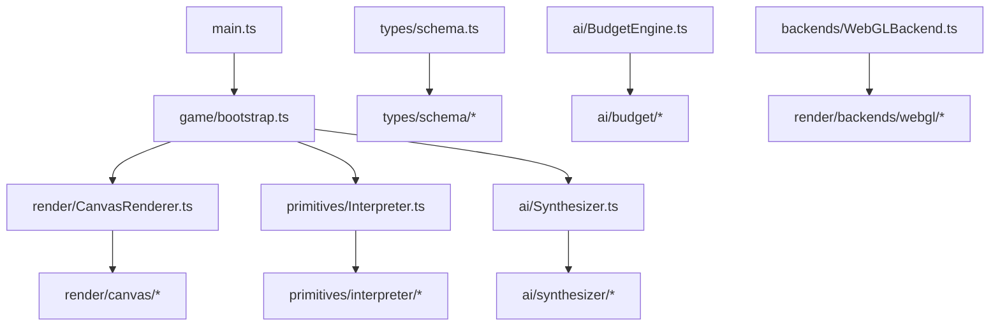

# Universal Kinetic Engine, VFX Upgrade & LLM Sync

This document summarizes the three major feature initiatives on this branch, the Plans 1–6 modularization refactor, and maps the current module layout.

**Totals:** ~141 `src/` files + 8 `scripts/` files + 3 config/root files

---

## Table of Contents

1. [Universal Kinetic Engine Overhaul](#1-universal-kinetic-engine-overhaul)
2. [WebGL VFX Upgrade](#2-webgl-vfx-upgrade)
3. [LLM Synthesizer (Spell Forger) Update](#3-llm-synthesizer-spell-forger-update)
4. [Modularization Refactor (Plans 1–6)](#4-modularization-refactor-plans-16)
5. [How the Pieces Connect](#5-how-the-pieces-connect)
6. [Per-File Module Map](#6-per-file-module-map)
7. [Files by Initiative](#7-files-by-initiative)

---

## 1. Universal Kinetic Engine Overhaul

### Core Idea

Abilities are no longer hardcoded game logic. They are **`AbilitySchema` JSON documents** — validated at load time, interpreted at runtime by `Interpreter.ts`, scored/balanced by `BudgetEngine.ts`, and authored by the Spell Forger in `Synthesizer.ts`.

```typescript
// src/types/schema.ts (barrel → src/types/schema/types.ts)
export interface AbilitySchema {
  id: string;
  name: string;
  cooldownMs: number;
  recoilKick: number;
  trajectory?: TrajectoryConfig;
  triggers: TriggerNode[];
  visuals?: VisualDescriptor;
  metadata?: Record<string, unknown>;
  inputProfile?: InputProfile;
  resourceCost?: ResourceCost;
}
```

### Grammar Expansion

| Category | Count | Examples |
|---|---|---|
| **Triggers** | 9 | `ON_CAST`, `ON_TICK`, `ON_HIT`, `ON_EXPIRY`, `ON_RETURN`, `ON_RECAST`, `ON_HIT_WALL`, `ON_DISTANCE_TRAVELED`, `ON_HAZARD_CONTACT` |
| **Actions** | 16 | `ADD_INSTABILITY`, `APPLY_IMPULSE`, `SPAWN_FIELD`, `SPAWN_PROJECTILE`, `SPAWN_CONSTRAINT`, `CAST_CHILD_PAYLOAD`, `MODIFY_STAT`, `TELEPORT`, `APPLY_STASIS`, `RELEASE_STASIS`, `REFLECT_PROJECTILES`, `SPAWN_OBSTACLE`, `MUTATE_TERRAIN`, `MORPH_ENTITY`, `SPAWN_ACTOR`, `APPLY_STEALTH` |
| **Conditions** | 5 | `STAT_THRESHOLD`, `TAG_CHECK`, `PROXIMITY_COUNT`, `SURFACE_TYPE`, `COMBO_STEP` (with optional `ifFalseActions` branching) |
| **Trajectories** | 5 | `LINEAR`, `RETURN_TO_SOURCE`, `ORBIT_ANCHOR`, `HOMING_SLERP`, `DISCONTINUOUS_BLINK` |
| **Fields** | 4 | `RADIAL_IMPULSE`, `VORTEX_TANGENT`, `FRICTION_OVERRIDE`, `MASS_ATTRACTOR` |
| **Input profiles** | 4 | `INSTANT`, `CHARGE_AND_RELEASE`, `CHANNELED`, `COMBO_CHAIN` |
| **Resource economies** | 4 | `COOLDOWN`, `HEAT`, `AMMO`, `HEALTH_PCT` |

### Runtime Architecture

| Layer | Role |
|---|---|
| `schema.ts` (barrel) | Re-exports types, constants, `validateAbilitySchema()` from `schema/*` |
| `Interpreter.ts` (barrel) | Re-exports `Interpreter` class from `interpreter/*` — trigger trees, action dispatch, VFX threading |
| `Trajectories.ts` | Per-frame projectile motion |
| `Fields.ts` | Spatial zone physics |
| `Player.ts` | Input profiles, resource state (heat/ammo/reload), combo steps |
| `PhysicsWorld.ts` | Entity simulation, terrain queries (`getSurfaceTypeAt`) |
| `BudgetEngine.ts` (barrel) | Re-exports sanitize/score/balance from `budget/*` |

### Key Behavioral Features

- **Relational impulses** — `APPLY_IMPULSE` uses `directionMode` (`AWAY_FROM_ORIGIN`, `TOWARDS_CASTER`, `ALONG_TRAJECTORY`, etc.) instead of generic outward knockback
- **Nested payloads** — `CAST_CHILD_PAYLOAD` with recursion depth limits and optional velocity/instability inheritance (MIRV bombs, fractal spells)
- **Emitter patterns** — `FAN`, `RADIAL`, `RANDOM_CONE`, `PARALLEL` with count/spread control
- **Lifecycle triggers** — `ON_DISTANCE_TRAVELED` (tripwires), `ON_HIT_WALL`, `ON_RECAST` (detonation), `fireOnHitDeath`
- **World interaction** — obstacles, terrain mutation (SAFE/LAVA patches), stasis freeze/release, morphs, turrets/decoys, stealth

### Grammar Gap Fixes

Three schema features that existed in types but were dead or broken at runtime were wired up:

1. **`ON_HAZARD_CONTACT`** — fires when a projectile enters lava (`Interpreter` checks `getSurfaceTypeAt`)
2. **`SURFACE_TYPE` conditions** — query terrain under a target via `world.getSurfaceTypeAt()`
3. **`REFLECT_PROJECTILES`** — extended beyond single-projectile reflection to work with a `radius` around a caster/zone

### Slot Categories vs. Runtime

`PRIMARY`, `SECONDARY`, `UTILITY`, `ULTIMATE`, `MOBILITY` affect **AI compilation, balancing, and UI flavor only** — not runtime behavior. A teleport in PRIMARY works the same as in MOBILITY; the slot is for loadout organization and power budget targeting.

### Test Preset Pack (~70+ spells across 11 groups)

Organized in `src/devtools/presetPacks/`:

| Group | Focus |
|---|---|
| Tier A — Core Demo | Regression baseline (Railgun, Boomerang, Cryo, etc.) |
| Tier B — Kinetic Recipes | Compiler reference spells |
| Phase 7 — Input Profiles | Charge, channel, combo |
| Phase 8 — Stasis | Freeze, momentum banking |
| Phase 9 — Terrain & Obstacles | Boulders, lava patches, minefields |
| Phase 10 — Metamorphism | Morph, stealth, turrets, decoys |
| Phase 11 — Resources | Heat, ammo, health-cost |
| Tier D — Advanced Grammar | Homing, blink, constraints, wall hits |
| Tier E — Conditional Logic | Branching, proximity checks, recursion |
| VFX Showcase | New visual grammar demos |
| Tier F — Diagnostics | Stress tests, grammar probes |

---

## 2. WebGL VFX Upgrade

### Problem Solved

The old system drew every particle as a separate Canvas2D circle — expensive at scale and visually flat (stacked translucent circles). The new system targets **high FPS under heavy VFX load** through instanced GPU rendering, parametric primitives, and quality tiers.

### Architecture

```
Interpreter / CanvasRenderer (shell → render/canvas/*)
        ↓
  ParticleSystem (facade, legacy API preserved)
        ↓
    VfxDirector (budgets, priorities, anti-overdraw)
        ↓
  ParticleBackend interface
   ├── WebGLBackend (shell → backends/webgl/*)
   └── Canvas2DBackend (fallback)
```

**WebGL stack** (`src/render/gl/`):

- `GLContext` — stacked transparent canvas over `#game-canvas`, DPR-capped, context loss/restore
- `InstancedQuadRenderer` — single draw call for thousands of quads via instance buffer
- `shaders.ts` — SDF shapes (disc, glow, ring, star, shard, streak, capsule, etc.)
- `PostFX` — bloom (threshold → separable blur → composite), chromatic aberration (ULTRA)
- `PrimitiveLayer` — parametric one-draw-call effects (shockwave rings, flashes, beams)

**Performance design principles:**

- Structure-of-Arrays particle storage with swap-remove
- Stateless GPU particles — spawn state uploaded once, position computed in vertex shader
- Anti-overdraw rule — `VfxDirector` rejects coincident same-material spawns
- Blend-mode sorted passes — normal instances first, additive second
- Spawn priorities — `CORE` > `PRIMARY` > `SECONDARY` > `AMBIENT` with budget gating

### Extended Visual Grammar

`VisualDescriptor` grew from 5 projectile styles / 5 trail types / 5 impact VFX to:

| Category | Count | Examples |
|---|---|---|
| Projectile styles | 10 | `PRISM`, `VOID_RIFT`, `CRYSTAL_SHARD`, `RUNE_SIGIL`, `PLASMA_TENDRIL` |
| Trail types | 10 | `EMBER_SPIRAL`, `FROST_CRYSTALS`, `VOID_TENDRIL`, `PLASMA_ARC`, `DUST_PUFF` |
| Impact VFX | 10 | `PLASMA_BLOOM`, `IMPLOSION`, `LIGHTNING_FORK`, `RUNE_FLASH`, `SHATTER` |
| VFX params (new) | 8 knobs | `glowIntensity`, `trailDensity`, `impactScale`, `secondaryColor`, `blendMode`, `shakeIntensity`, `distortion` |

The `vfx` block threads through validation (`schema/*`), sanitization (`budget/*`), runtime (`interpreter/*`), and rendering.

### Quality & Performance System

**`graphicsSettings.ts`** — 5 tiers (`LOW` → `ULTRA` + `AUTO`) controlling particle budget, DPR cap, bloom passes, trail density, max primitives, ground decals, refraction.

**`AdaptiveQuality.ts`** — watches p95 frame time, steps tier down/up with hysteresis and cooldowns.

**`PerfMonitor.ts`** — rolling FPS, p50/p95 frame times, sim vs render split, live particle/primitive/draw-call counts, GPU capability probe.

**Inspector Graphics tab** — tier buttons, perf overlay (F3), baseline recording, force GL context loss, Canvas2D fallback toggle.

### Non-Projectile VFX

`CanvasRenderer` (shell) delegates to `render/canvas/*` for palette-driven effects on fields, terrain mutations, obstacles, morphs, stealth shimmer, summons, and stasis crystallization.

### Post-Launch Bug Fixes

1. **Peach screen overlay** — PostFX compositing viewport/DPR mismatch
2. **Giant blobs on cast** — additive/normal instance buffer interleaving corrupting shader attributes
3. **Canvas misalignment** — fixed positioning, z-index layering, unified DPR between game and VFX canvases

---

## 3. LLM Synthesizer (Spell Forger) Update

### Three-Stage Pipeline

| Stage | Prompt | Output |
|---|---|---|
| **Forge** | `FORGE_SYSTEM_PROMPT` | 3 ability *concepts* (title, tagline, description) |
| **Compile** | `COMPILER_SYSTEM_PROMPT` | Full `AbilitySchema` JSON |
| **Evolve** | `EVOLUTION_SYSTEM_PROMPT` | 3 variants of an existing spell |

### What Changed in the Compiler Prompt

The `COMPILER_SYSTEM_PROMPT` was massively expanded to mirror the full engine grammar:

- Complete `inputProfile` and `resourceCost` specs with worked examples
- All 9 triggers, 16 actions, 5 conditions with field-level documentation
- Semantic recipes (charged shot, heat flamer, stasis combo, crowd breaker, morph colossus, tripwire bomb, etc.)
- **Visual recipe book** — archetype → palette mappings (Frost, Fire, Void, Lightning, Holy, Toxic, Kinetic, Arcane)
- Full new VFX enum vocabulary and `vfx` parameter block

### Repair & Validation Sync

- `TRIGGER_TYPES` / `ACTION_TYPES` imported from `schema.ts` (single source of truth)
- `repairVisualDescriptor` handles the `vfx` object (implementation in `ai/synthesizer/llmRepair.ts`)
- `repairActionPayload` recursively repairs `CAST_CHILD_PAYLOAD` children
- `repairTriggerNode` preserves `ifFalseActions`
- New `PROJECTILE_STYLE_ALIASES` (CRYSTAL → `CRYSTAL_SHARD`, VOID → `VOID_RIFT`, etc.)
- `resolveKineticRecipe()` keyword routing expanded (charge, heat, combo, morph, stealth, turret, lava)

### Budget & Balancing

- `getCastingResourceModifier()` — channel/combo/charge spells and heat/ammo/health costs adjust power scores
- `CATEGORY_BUDGETS` + `CATEGORY_COMPILE_HINTS` passed into compile prompts
- Parent visual metadata passed during evolution ("mutate palette, don't reroll colors")
- `maxOutputTokens` raised to 3072 for larger schemas

---

## 4. Modularization Refactor (Plans 1–6)

After the feature initiatives landed, six refactor-only plans split monolithic files into focused modules while **preserving every public import path** via barrel/shell entry files.

### Plan Summary

| Plan | Barrel / shell (public import path) | Implementation directory |
|---|---|---|
| 1 | `src/types/schema.ts` | `src/types/schema/*` |
| 2 | `src/ai/BudgetEngine.ts` | `src/ai/budget/*` |
| 3 | `src/ai/Synthesizer.ts` | `src/ai/synthesizer/*` |
| 4 | `src/primitives/Interpreter.ts` | `src/primitives/interpreter/*` |
| 5 | `src/main.ts`, `DraftModal.ts`, `InspectorUI.ts` | `src/game/*`, `src/draft/*`, `src/devtools/inspector/*` |
| 6 | `CanvasRenderer.ts`, `WebGLBackend.ts` | `src/render/canvas/*`, `src/render/backends/webgl/*` |

**Design constraint:** Consumers keep importing the same paths (`from '../types/schema'`, `from './ai/BudgetEngine'`, etc.). Only implementation files moved; no feature or behavior changes.

### Regression Harness

| Script | What it guards |
|---|---|
| `npm run test:schemas` | Preset power scores (`scripts/schema-scores.snapshot.json`) |
| `npm run test:offline` | Offline forge/evolution generators |
| `npm run test:interpreter` | Headless cast entity counts (`scripts/interpreter-casts.snapshot.json`) |
| `npm run test:settings` | localStorage clamp defaults + cooldown pacing |
| `npm run test:render` | Color helpers, sprite cache keys, spawn priority (`scripts/render-helpers.snapshot.json`) |

**Acceptance gate (all plans):** `tsc --noEmit` + all five harnesses + `npm run build`.

### Plan 5 — Game Shell (`src/game/`)

| File | Role |
|---|---|
| `bootstrap.ts` | `startGame()`: init, event listeners, loop wiring |
| `GameApp.ts` | App state container (world, player, renderer, etc.) |
| `settings.ts` | Shared localStorage keys (arena radius, combatant radius, cooldown pacing) |
| `loadout.ts` | Default loadout, draft equip, compile generation staleness |
| `arena.ts` | Arena reset, respawn, hex center, canvas resize |
| `input.ts` | Player cast input and movement |
| `simulation.ts` | Arena sync, spatial fields, simulation step |
| `matchFlow.ts` | Draft/match gating, equip handlers |
| `perfOverlay.ts` | F3 performance overlay draw |
| `MatchManager.ts` | Match state machine (unchanged monolith) |
| `ArenaShrink.ts` | Hex arena shrink timer (unchanged monolith) |

`src/main.ts` is a thin Vite entry: `import { startGame } from './game/bootstrap'; startGame();`

---

## 5. How the Pieces Connect



**The contract is JSON.** A spell's `triggers[]` define *what happens*, `trajectory` defines *how it moves*, `inputProfile`/`resourceCost` define *how the player casts it*, and `visuals` define *how it looks*. Barrels at the original import paths keep the dependency graph stable.

---

## 6. Per-File Module Map

Layer key: **Barrel** = thin re-export entry; **Shell** = public class with delegated implementation; **Impl** = internal module.

### Root & Config

| File | Layer | Role |
|---|---|---|
| `index.html` | Config | Canvas z-index layering (`#game-canvas` z-index 0, `#inspector-root` z-index 10) for WebGL VFX overlay stacking |
| `package.json` | Config | Vite/TypeScript scripts (`dev`, `build`, `preview`, `test:schemas`, `test:offline`, `test:interpreter`, `test:settings`, `test:render`); `tsx` devDep |
| `tsconfig.json` | Config | Strict ES2022 / ESNext module config |

### Types & Schema

| File | Layer | Role |
|---|---|---|
| `src/types/schema.ts` | Barrel | Re-exports types, constants, `validateAbilitySchema()` |
| `src/types/schema/types.ts` | Impl | `AbilitySchema`, trigger/action/condition types, `VisualDescriptor`, etc. |
| `src/types/schema/constants.ts` | Impl | `TRIGGER_TYPES`, `ACTION_TYPES`, enum constants |
| `src/types/schema/validators/*` | Impl | Per-domain validators (ability, action, trigger, trajectory, field, etc.) |
| `src/types/triggerContext.ts` | Impl | `TriggerContext`, `ExecutionOverrides` |
| `src/types/cards.ts` | Impl | `SkillCategory`, action slot keys, `CATEGORY_SLOT_MAP` |

### Engine & Game Loop

| File | Layer | Role |
|---|---|---|
| `src/main.ts` | Entry | Thin Vite entry: calls `startGame()` |
| `src/engine/Loop.ts` | Impl | Fixed-timestep game loop with `perfMonitor` sim/render split |
| `src/engine/PhysicsWorld.ts` | Impl | Core physics: collisions, lava tags, stasis skip, terrain patches, `getSurfaceTypeAt()` |
| `src/game/bootstrap.ts` | Impl | App init, event listeners, render loop |
| `src/game/GameApp.ts` | Impl | Application state container |
| `src/game/settings.ts` | Impl | Shared localStorage keys and cooldown pacing getters |
| `src/game/loadout.ts` | Impl | Loadout assignment, draft equip, compile staleness |
| `src/game/arena.ts` | Impl | Arena reset, respawn, resize |
| `src/game/input.ts` | Impl | Player cast and movement input |
| `src/game/simulation.ts` | Impl | Arena sync, spatial fields, simulation step |
| `src/game/matchFlow.ts` | Impl | Draft/match gating and handlers |
| `src/game/perfOverlay.ts` | Impl | F3 performance overlay |
| `src/game/MatchManager.ts` | Impl | Match state machine |
| `src/game/ArenaShrink.ts` | Impl | Hex arena shrink timer and radius logic |

### Primitives — Runtime Interpreter

| File | Layer | Role |
|---|---|---|
| `src/primitives/Interpreter.ts` | Barrel | Re-exports `Interpreter`, `buildTriggerMap` |
| `src/primitives/interpreter/Interpreter.ts` | Impl | Class: `executeAbility`, lifecycle orchestration |
| `src/primitives/interpreter/actions.ts` | Impl | Action dispatch + emitter execution |
| `src/primitives/interpreter/lifecycle.ts` | Impl | Hit/return/expiry/tick processing |
| `src/primitives/interpreter/triggers.ts` | Impl | Trigger tree walking |
| `src/primitives/interpreter/conditions.ts` | Impl | Condition evaluation |
| `src/primitives/interpreter/targeting.ts` | Impl | Target resolution |
| `src/primitives/interpreter/helpers.ts` | Impl | `buildTriggerMap`, shared utilities |
| `src/primitives/interpreter/constants.ts` | Impl | Action priority ordering |
| `src/primitives/Trajectories.ts` | Impl | Per-frame projectile motion |
| `src/primitives/Fields.ts` | Impl | Spatial zone force application |

### Entities (9 files)

| File | Layer | Role |
|---|---|---|
| `src/entities/Entity.ts` | Impl | Base entity: position, velocity, mass, tags, stasis/morph/stealth timers |
| `src/entities/Player.ts` | Impl | Input, casting, `inputProfile` modes, `resourceCost` economies, combo tracking |
| `src/entities/Projectile.ts` | Impl | Projectile lifecycle, `visuals`, `inHazard` flag, per-trigger accumulators |
| `src/entities/SpatialZone.ts` | Impl | Field zones from `SPAWN_FIELD` |
| `src/entities/Obstacle.ts` | Impl | Destructible/timed obstacles from `SPAWN_OBSTACLE` |
| `src/entities/ConstraintJoint.ts` | Impl | Spring tether, distance rod, surface pin from `SPAWN_CONSTRAINT` |
| `src/entities/Summon.ts` | Impl | Turret/decoy actors from `SPAWN_ACTOR` |
| `src/entities/Dummy.ts` | Impl | Training dummy combatant |
| `src/entities/BotController.ts` | Impl | Simple AI movement for bot dummies |

### Rendering — Canvas World

| File | Layer | Role |
|---|---|---|
| `src/render/CanvasRenderer.ts` | Shell | `render()` orchestration; delegates to `render/canvas/*` |
| `src/render/canvas/colors.ts` | Impl | `FIELD_COLORS`, `instabilityColor`, `healthBarColor` |
| `src/render/canvas/helpers.ts` | Impl | `lerpPos` |
| `src/render/canvas/SpriteCache.ts` | Impl | Baked glow sprite cache |
| `src/render/canvas/background.ts` | Impl | Lava sea, heat waves |
| `src/render/canvas/arena.ts` | Impl | Hex platform draw |
| `src/render/canvas/worldLayers.ts` | Impl | Zones, terrain, obstacles, constraints |
| `src/render/canvas/entities.ts` | Impl | Combatants, summons, stasis overlay |
| `src/render/canvas/projectiles.ts` | Impl | Projectile styles, chaos lightning |
| `src/render/canvas/hud.ts` | Impl | Overhead health/instability HUD |
| `src/render/canvas/debug.ts` | Impl | Debug overlay (`DebugOptions`) |
| `src/render/canvas/renderCtx.ts` | Impl | `CanvasRenderCtx` state bag |
| `src/render/ActionBarHUD.ts` | Impl | Ability bar UI with resource badges, charge meter, cooldown display |
| `src/render/MatchHUD.ts` | Impl | Match overlay (start, state, winner) |

### Rendering — WebGL VFX Stack

| File | Layer | Role |
|---|---|---|
| `src/render/ParticleSystem.ts` | Shell | Public VFX facade — delegates to `VfxDirector` |
| `src/render/VfxDirector.ts` | Impl | Budget enforcement, spawn priorities, anti-overdraw |
| `src/render/PrimitiveLayer.ts` | Impl | Parametric one-draw-call effects |
| `src/render/AdaptiveQuality.ts` | Impl | p95-driven tier stepping when `tier: AUTO` |
| `src/render/ScreenShake.ts` | Impl | Impact screen shake |
| `src/render/backends/ParticleBackend.ts` | Impl | Backend interface: spawn methods, counters, `SpawnPriority` |
| `src/render/backends/WebGLBackend.ts` | Shell | WebGL2 lifecycle; delegates to `backends/webgl/*` |
| `src/render/backends/webgl/types.ts` | Impl | `SimParticle` interface |
| `src/render/backends/webgl/spawnPriority.ts` | Impl | `canSpawnAtCount` budget gating |
| `src/render/backends/webgl/particleSim.ts` | Impl | Particle integration, `makeParticle` |
| `src/render/backends/webgl/instancePacking.ts` | Impl | GPU instance buffer packing |
| `src/render/backends/webgl/spawnPrimitives.ts` | Impl | Disc/glow/ring/streak/flash/sparks |
| `src/render/backends/webgl/vfxRecipes.ts` | Impl | Muzzle flash, impact burst, trails, embers |
| `src/render/backends/Canvas2DBackend.ts` | Impl | Canvas2D fallback implementing same API |
| `src/render/backends/createParticleBackend.ts` | Impl | Factory: probes WebGL2, selects backend |
| `src/render/gl/GLContext.ts` | Impl | Stacked transparent WebGL2 canvas, DPR-capped resize |
| `src/render/gl/InstancedQuadRenderer.ts` | Impl | Instanced quad draw, blend-sorted passes |
| `src/render/gl/shaders.ts` | Impl | GLSL shaders: SDF shapes, bloom |
| `src/render/gl/PostFX.ts` | Impl | FBO scene render, bloom pipeline, chromatic aberration |
| `src/render/gl/framebuffers.ts` | Impl | FBO creation, fullscreen quad helpers |
| `src/render/gl/NoiseTexture.ts` | Impl | Random noise texture for organic shader shapes |

### AI / LLM Pipeline

| File | Layer | Role |
|---|---|---|
| `src/ai/Synthesizer.ts` | Barrel | Re-exports settings, status, offline generators, `synthesizeAbility`, `synthesizeCards` |
| `src/ai/synthesizer/settings.ts` | Impl | API key, base URL, model storage |
| `src/ai/synthesizer/status.ts` | Impl | Connection status, last synthesis meta |
| `src/ai/synthesizer/prompts.ts` | Impl | Forge/Compile/Evolution system prompts |
| `src/ai/synthesizer/compile.ts` | Impl | LLM compile orchestration |
| `src/ai/synthesizer/api.ts` | Impl | `synthesizeAbility`, `synthesizeCards` facade |
| `src/ai/synthesizer/cards.ts` | Impl | Draft card building |
| `src/ai/synthesizer/geminiClient.ts` | Impl | Gemini HTTP transport |
| `src/ai/synthesizer/llmRepair.ts` | Impl | JSON repair heuristics for LLM output |
| `src/ai/synthesizer/offline/forge.ts` | Impl | Offline forge + `resolveKineticRecipe` |
| `src/ai/synthesizer/offline/evolution.ts` | Impl | Offline evolution generator |
| `src/ai/BudgetEngine.ts` | Barrel | Re-exports sanitize, score, balance, repair |
| `src/ai/budget/constants.ts` | Impl | `CATEGORY_BUDGETS`, power constants |
| `src/ai/budget/score.ts` | Impl | Power scoring |
| `src/ai/budget/balance.ts` | Impl | Category balancing |
| `src/ai/budget/repair.ts` | Impl | Semantic repair |
| `src/ai/budget/helpers.ts` | Impl | Shared budget helpers |
| `src/ai/budget/sanitize/*` | Impl | Per-domain sanitizers (ability, action, trigger, visuals, etc.) |

### DevTools & Presets

| File | Layer | Role |
|---|---|---|
| `src/devtools/InspectorUI.ts` | Shell | Tab routing, collapse, telemetry; delegates to `inspector/*` |
| `src/devtools/inspector/statsTab.ts` | Impl | Stats tab + cooldown slider wiring |
| `src/devtools/inspector/presetsTab.ts` | Impl | Preset load buttons |
| `src/devtools/inspector/jsonTab.ts` | Impl | JSON schema editor |
| `src/devtools/inspector/graphicsTab.ts` | Impl | Graphics tier controls |
| `src/devtools/inspector/harnessTab.ts` | Impl | AI settings, match controls, spawn buttons |
| `src/devtools/inspector/telemetry.ts` | Impl | Telemetry DOM builder |
| `src/devtools/inspector/domHelpers.ts` | Impl | Shared tab chrome (buttons, sliders) |
| `src/devtools/graphicsSettings.ts` | Impl | Quality tiers, `TierLimits`, DPR cap |
| `src/devtools/PerfMonitor.ts` | Impl | Rolling FPS/p50/p95, GPU capability probe |
| `src/devtools/Presets.ts` | Impl | Re-exports from `presetPacks/index` |
| `src/devtools/SpellLibrary.ts` | Impl | Searchable preset browser |
| `src/devtools/presetPacks/*` | Impl | 11 preset groups (~70+ spells) |

### UI / Draft

| File | Layer | Role |
|---|---|---|
| `src/draft/DraftModal.ts` | Shell | Workshop UI class; delegates to helpers |
| `src/draft/workshopStyles.ts` | Impl | Rarity colors, style injection, button/chip helpers |
| `src/draft/mechanicBadges.ts` | Impl | Badge classification and rendering |
| `src/draft/synthesisPrefetch.ts` | Impl | Prefetch cache and synthesis timing |

### Math Utilities

| File | Layer | Role |
|---|---|---|
| `src/math/Vector2D.ts` | Impl | 2D vector math |
| `src/math/HexMath.ts` | Impl | Hex containment, edge distance, `clampToHex` |

### Scripts (regression harness)

| File | Role |
|---|---|
| `scripts/test-schemas.ts` | Schema power score regression |
| `scripts/test-offline.ts` | Offline generator checks |
| `scripts/test-interpreter.ts` | Headless cast harness |
| `scripts/test-settings.ts` | Settings clamp harness |
| `scripts/test-render.ts` | Render helper harness |
| `scripts/schema-scores.snapshot.json` | Golden preset scores |
| `scripts/interpreter-casts.snapshot.json` | Golden cast entity counts |
| `scripts/render-helpers.snapshot.json` | Golden color/key/priority values |

---

## 7. Files by Initiative

| Initiative | Files |
|---|---|
| **Kinetic Engine** | `schema/*`, `triggerContext.ts`, `Interpreter.ts` + `interpreter/*`, `Trajectories.ts`, `Fields.ts`, `PhysicsWorld.ts`, all `entities/*`, `Player.ts`, `cards.ts`, all `presetPacks/*`, `ActionBarHUD.ts`, `DraftModal.ts` + `draft/*` helpers |
| **VFX Upgrade** | All `render/*` including `canvas/*` and `backends/webgl/*`, `graphicsSettings.ts`, `PerfMonitor.ts`, `AdaptiveQuality.ts`, `ScreenShake.ts`, `index.html`, VFX parts of `interpreter/*`, `game/bootstrap.ts`, `Loop.ts`, `CanvasRenderer.ts`, `vfxShowcase.ts`, `diagnostics.ts` |
| **LLM Sync** | `Synthesizer.ts` + `synthesizer/*`, `BudgetEngine.ts` + `budget/*`, `DraftModal.ts`, `schema/*` (validation enums), `kineticRecipes.ts` |
| **Modularization** | All barrel/shell entry files, `game/*`, `devtools/inspector/*`, `render/canvas/*`, `render/backends/webgl/*`, `scripts/test-*` |

### Notable Absences

- `tsx` added as devDependency (harness runner only; no new runtime npm deps)
- Five headless regression harnesses with golden snapshots; no browser/Playwright tests
- No CI pipeline yet
- Largest remaining monoliths (not yet split): `PhysicsWorld.ts` (~747 LOC), `llmRepair.ts` (~821 LOC), `ActionBarHUD.ts` (~457 LOC)
