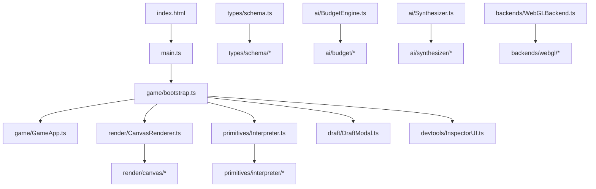

# Refactoring Summary — Plans 1–6

A **refactor-only** pass across six plans. No features, no behavior changes, no UX changes. The goal was to break up large monolithic files into focused modules while **keeping every public import path stable** so existing consumers did not need updates.

**Before:** ~62 tightly coupled source files, several 600–2,500+ line monoliths, no regression harnesses.  
**After:** ~141 `src/` files, barrel/shell entry points, five headless test harnesses with golden snapshots, and updated docs in [`OVERHAUL_MAP.md`](OVERHAUL_MAP.md).

---

## Core Design Principles

### 1. Barrel / shell pattern

Public entry files stay at their original paths. Implementation moves into subdirectories:

| Pattern | Meaning | Examples |
|---------|---------|----------|
| **Barrel** | Thin re-export file | `schema.ts`, `BudgetEngine.ts`, `Synthesizer.ts`, `Interpreter.ts` |
| **Shell** | Public class that delegates to helpers | `CanvasRenderer.ts`, `WebGLBackend.ts`, `DraftModal.ts`, `InspectorUI.ts` |
| **Impl** | Internal modules consumers don't import directly | `schema/validators/*`, `interpreter/actions.ts`, `render/canvas/*` |

### 2. Import-path stability

`from '../types/schema'`, `from './ai/BudgetEngine'`, `from './primitives/Interpreter'`, etc. all still resolve to the same entry files. `index.html` still loads `/src/main.ts`.

### 3. Move-only refactors

Logic was extracted verbatim — parameter passing replaced closures over globals, but dispatch order, VFX recipes, scoring formulas, and UI copy were not changed.

### 4. Regression gates per plan

Each plan added or extended headless harnesses. The standard acceptance gate:

```
npx tsc --noEmit
npm run test:schemas
npm run test:offline
npm run test:interpreter
npm run test:settings   # from Plan 5
npm run test:render     # from Plan 6
npm run build
```

---

## Plan-by-Plan Breakdown

### Plan 1 — Foundation (Schema)

**Problem:** `src/types/schema.ts` was ~1,295 lines — types, constants, and validators in one file.

**Split:**

```
src/types/
  schema.ts              # barrel (unchanged import path)
  schema/
    types.ts             # AbilitySchema, TriggerNode, VisualDescriptor, etc.
    constants.ts         # TRIGGER_TYPES, ACTION_TYPES
    validators/
      ability.ts, action.ts, trigger.ts, trajectory.ts, field.ts, ...
      helpers.ts
```

**Harness added:** `npm run test:schemas` — scores all 61 presets against `scripts/schema-scores.snapshot.json`.

**Commits:** harness setup + schema split (2 commits).

---

### Plan 2 — Budget Engine

**Problem:** `src/ai/BudgetEngine.ts` was ~1,288 lines — scoring, sanitization, balancing, and repair mixed together.

**Split:**

```
src/ai/
  BudgetEngine.ts        # barrel
  budget/
    constants.ts, score.ts, balance.ts, repair.ts, helpers.ts
    sanitize/
      ability.ts, action.ts, trigger.ts, trajectory.ts, visuals.ts, ...
```

**Harness:** Reuses `test:schemas` (snapshot must stay unchanged).

**Commits:** scoring extract → sanitize extract → balance/repair + barrel (3 commits).

---

### Plan 3 — Synthesizer

**Problem:** `src/ai/Synthesizer.ts` was ~2,582 lines — LLM transport, prompts, offline generators, repair, and API facade all in one file.

**Split:**

```
src/ai/
  Synthesizer.ts         # barrel
  synthesizer/
    settings.ts, status.ts, prompts.ts, compile.ts, api.ts, cards.ts
    geminiClient.ts, llmRepair.ts
    offline/forge.ts, offline/evolution.ts
```

**Harness added:** `npm run test:offline` — 5 offline generator checks.

**Commits:** offline generators → LLM repair/client → settings/prompts/facade barrel (3 commits).

---

### Plan 4 — Interpreter

**Problem:** `src/primitives/Interpreter.ts` was ~924 lines — trigger walking, action dispatch, conditions, lifecycle, and targeting intertwined.

**Split:**

```
src/primitives/
  Interpreter.ts         # barrel
  interpreter/
    Interpreter.ts       # class + executeAbility
    actions.ts           # dispatchAction, executeEmitter (largest/riskiest extract)
    lifecycle.ts         # hit/return/expiry/tick loops
    triggers.ts          # trigger tree walking
    conditions.ts        # condition evaluation
    targeting.ts         # target resolution
    helpers.ts           # buildTriggerMap, utilities
    constants.ts         # action priority ordering
```

**Harness added:** `npm run test:interpreter` — headless casts of 8 presets, entity counts snapshotted in `scripts/interpreter-casts.snapshot.json`.

**Commits:** helpers + harness → action dispatch → lifecycle + barrel (3 commits).

---

### Plan 5 — App Shell & UI

**Problem:** Three large UI/bootstrap files with duplicated localStorage settings:

- `src/main.ts` (~602 LOC) — entire game loop, input, match flow, settings
- `src/draft/DraftModal.ts` (~993 LOC) — workshop UI + styles + badges + prefetch
- `src/devtools/InspectorUI.ts` (~875 LOC) — all inspector tabs inline

**Split:**

```
src/
  main.ts                          # 3 lines: startGame()
  game/
    bootstrap.ts                   # init, listeners, loop wiring
    GameApp.ts                     # state container (replaces module globals)
    settings.ts                    # shared localStorage keys (deduped from InspectorUI)
    loadout.ts, arena.ts, input.ts, simulation.ts, matchFlow.ts, perfOverlay.ts
    MatchManager.ts, ArenaShrink.ts  # unchanged monoliths

  draft/
    DraftModal.ts                  # shell
    workshopStyles.ts, mechanicBadges.ts, synthesisPrefetch.ts

  devtools/
    InspectorUI.ts                 # shell (tabs, collapse, telemetry)
    inspector/
      statsTab.ts, presetsTab.ts, jsonTab.ts, graphicsTab.ts, harnessTab.ts
      telemetry.ts, domHelpers.ts
```

**Key architectural change:** Module-level `let world, player, ...` globals became a `GameApp` class; extracted functions take `app: GameApp` explicitly.

**Settings dedup:** Arena radius, combatant radius, and cooldown pacing keys consolidated into `game/settings.ts` (used by bootstrap and inspector stats tab).

**Harness added:** `npm run test:settings` — 13 clamp/pacing checks.

**Commits:** game bootstrap → DraftModal helpers → InspectorUI tabs (3 commits).

---

### Plan 6 — Rendering

**Problem:** Two large rendering files deferred from Plan 5:

- `src/render/CanvasRenderer.ts` (~900 LOC) — lava, arena, entities, sprites, HUD, debug all inline
- `src/render/backends/WebGLBackend.ts` (~668 LOC) — particle sim, instance packing, spawn methods, VFX recipes

**Split:**

```
src/render/
  CanvasRenderer.ts              # shell: render() orchestration
  canvas/
    colors.ts, helpers.ts, SpriteCache.ts, renderCtx.ts
    background.ts, arena.ts, worldLayers.ts, entities.ts
    projectiles.ts, hud.ts, debug.ts

  backends/
    WebGLBackend.ts              # shell: ParticleBackend lifecycle
    webgl/
      types.ts, spawnPriority.ts, particleSim.ts, instancePacking.ts
      spawnPrimitives.ts, vfxRecipes.ts   # triggerImpactBurst switch moved verbatim
```

**Harness added:** `npm run test:render` — color helpers, sprite cache key format, spawn priority gating; snapshotted in `scripts/render-helpers.snapshot.json`.

**Commits:** CanvasRenderer layers → WebGLBackend modules (2 commits).

---

## Regression Harness Suite

| Script | Guards | Snapshot |
|--------|--------|----------|
| `test:schemas` | Preset power scores after sanitize | `schema-scores.snapshot.json` |
| `test:offline` | Offline forge/evolution generators | inline assertions |
| `test:interpreter` | Headless cast entity counts | `interpreter-casts.snapshot.json` |
| `test:settings` | localStorage clamp defaults, cooldown pacing | inline assertions |
| `test:render` | Color helpers, sprite keys, spawn priority | `render-helpers.snapshot.json` |

All run via `tsx` (devDependency). No browser/Playwright tests. No CI pipeline yet.

---

## Architecture After Refactor



**Unchanged monoliths** (candidates for future splits):

| File | ~LOC | Notes |
|------|------|-------|
| `PhysicsWorld.ts` | 747 | Engine core — highest risk |
| `llmRepair.ts` | 821 | Internal to synthesizer barrel |
| `ActionBarHUD.ts` | 457 | UI overlay |
| `DraftModal.ts` | 760 | Shell only, but still large orchestration |

---

## What Did NOT Change

- Game behavior, spell grammar, VFX recipes, scoring formulas
- Public APIs (`DraftModal` methods, `InspectorUI` methods, `Interpreter.executeAbility`, etc.)
- UX copy, CSS colors, tab order, keyboard bindings (Tab/B draft, F1 inspector, F3 perf)
- `index.html`, preset pack content, shader code
- Import paths for any external consumer

---

## Commit History (refactor series)

```
Plan 1:  schema harness + split
Plan 2:  budget scoring → sanitize → balance/repair
Plan 3:  offline generators → LLM repair → synthesizer facade
Plan 4:  interpreter helpers → action dispatch → lifecycle barrel
Plan 5:  game bootstrap → DraftModal helpers → InspectorUI tabs
Plan 6:  CanvasRenderer layers → WebGLBackend modules
Docs:    update OVERHAUL_MAP for Plans 1–6 modularization
```

Representative commit messages:

- `refactor: extract budget scoring modules`
- `refactor: extract schema types from validators`
- `refactor: extract synthesizer offline generators`
- `refactor: extract interpreter helpers and add cast harness`
- `refactor: extract game settings and bootstrap from main`
- `refactor: split DraftModal helpers`
- `refactor: split InspectorUI tab builders`
- `refactor: split CanvasRenderer layer modules`
- `refactor: split WebGLBackend spawn and VFX modules`
- `docs: update OVERHAUL_MAP for Plans 1–6 modularization`

---

## Documentation

- [`OVERHAUL_MAP.md`](OVERHAUL_MAP.md) — full feature + module map (updated after Plans 1–6)
- This file — refactor-focused narrative summary

---

## Bottom Line

The codebase went from a handful of very large files to a **layered, testable module tree** with stable import paths. You can work on schema validation, budget scoring, interpreter dispatch, game loop, canvas drawing, or WebGL VFX in isolation without touching unrelated systems. Five headless harnesses catch regressions on every plan's acceptance gate.

**Plans 1–6 are complete.** The natural next step (Plan 7, not yet written) would be splitting `PhysicsWorld.ts` with a headless physics-step harness — the largest remaining monolith in the engine core.
