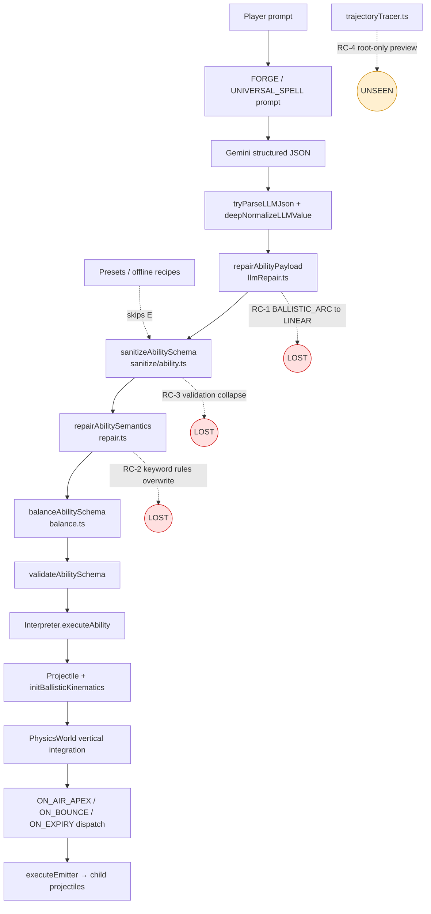

# 02 — Pipeline Audit: Where Intent Is Lost

> **Kind:** Facts. Change only when the code changes.
> **Source anchor:** commit `53e3893` (2026-09-08).
> **Trigger case:** prompts like *"Cluster Bomblets that bounce"*, *"Splitting homing needles"*
> return flat single-stage linear projectiles.

---

## The decisive observation

`Cluster Mortar` — a preset with a ballistic parent, an `ON_AIR_APEX` fan of three bouncing
bomblets, and an `ON_BOUNCE` field — **works correctly in game**. An identical JSON schema
produced by the LLM does not.

The only structural difference between those two paths is one function.

| Path | Goes through `repairAbilityPayload`? | Entry point |
|---|---|---|
| Presets → loadout | **No** | [`loadout.ts`](../../src/game/loadout.ts) L65, L87 → `sanitizeAbilitySchema` directly |
| Universal LLM generation | Yes | [`geminiClient.ts`](../../src/ai/synthesizer/geminiClient.ts) L445 |
| Lazy card compilation | Yes | [`compile.ts`](../../src/ai/synthesizer/compile.ts) L150 |
| Draft card repair | Yes | [`llmRepair.ts`](../../src/ai/synthesizer/llmRepair.ts) L711 |
| Inspector JSON paste | Yes | [`jsonTab.ts`](../../src/devtools/inspector/jsonTab.ts) L139 |

`[Verified]` In every LLM-facing path, `repairAbilityPayload` runs **before**
`sanitizeAbilitySchema`. Presets skip it entirely. That asymmetry is the whole symptom.

**Falsifiable check requiring no code reading:** cast the `Cluster Mortar` preset (splits and
bounces), then paste that same JSON into the Inspector JSON tab and cast it. If the pasted
version flies flat, RC-1 below is confirmed.

---

## Pipeline map



---

## RC-1 — `repairTrajectoryConfig` downgrades `BALLISTIC_ARC` to `LINEAR`

**Severity: critical. Effort to fix: one line.**

[`llmRepair.ts`](../../src/ai/synthesizer/llmRepair.ts) L308:

```ts
const VALID_TRAJECTORY_TYPES = new Set([
  'LINEAR',
  'RETURN_TO_SOURCE',
  'ORBIT_ANCHOR',
  'HOMING_SLERP',
  'DISCONTINUOUS_BLINK',
]);
```

`BALLISTIC_ARC` is absent. In `repairTrajectoryConfig` (L459):

```ts
const isSkyDrop = rawAltitude > 0 || (rawFallSpeed > 0 && rawLobApex <= 0);
...
if (isSkyDrop) {
  t.type = 'BALLISTIC_ARC';
  ...
} else if (typeof t.type !== 'string' || !VALID_TRAJECTORY_TYPES.has(t.type)) {
  t.type = 'LINEAR';   // L497
}
```

Trace for a forward mortar lob (`lobApex: 150`, no `spawnAltitude`, no `fallSpeed`):
`isSkyDrop` is `false` → falls to the `else if` → `'BALLISTIC_ARC'` is not in the set →
**coerced to `LINEAR`**. `[Verified]`

Sky drops survive only because the `isSkyDrop` branch re-asserts the type before the
whitelist is consulted. That is why meteor-style spells work while mortars do not.

`repairActionPayload` (L560) calls the same function on every nested
`SPAWN_PROJECTILE.projectileTrajectory`, so **child bomblets are flattened too**. `[Verified]`

**Corruption fingerprint.** `sanitizeTrajectory`
([`sanitize/trajectory.ts`](../../src/ai/budget/sanitize/trajectory.ts) L63–74) preserves
`lobApex`, `bounces`, `bounceRestitution` whenever those keys are present, gated on
`!== undefined` rather than on type. So a corrupted spell reaches the interpreter as a
`LINEAR` trajectory **still carrying ballistic-only fields** — a state no valid authoring
produces. That is both a diagnostic signal and a cheap assertion. `[Verified]`

Related: `TRAJECTORY_ALIASES` (L293) has no entry mapping `MORTAR`, `LOB`, `BALLISTIC`, or
`ARC` to `BALLISTIC_ARC`, so those tokens also fall through to `LINEAR`. `[Verified]`

---

## RC-2 — Semantic repair overwrites authored values

**Severity: moderate today, critical for the Evolution Tree.**

`sanitizeAbilitySchema` unconditionally re-runs the keyword rules on every pass
([`sanitize/ability.ts`](../../src/ai/budget/sanitize/ability.ts) L121):

```ts
const repairText =
  description ??
  [validated.tagline, validated.description].filter(Boolean).join(' ');
const repaired = repairAbilitySemantics(validated, repairText, isHeadlessMode);
```

Several rules replace rather than fill. The clearest is
[`repair.ts`](../../src/ai/budget/repair.ts) → `applyRuleE_Orbit` (L492):

```ts
schema.trajectory = {
  type: 'ORBIT_ANCHOR',
  orbitRadius: 70,
  orbitSpeed: 3.0,
  maxRange: 800,
};
```

Triggered by `orbiting|orbits|orbit|circling|circle|ring|halo|surround|revolving|rotating|
satellite|whirling` — words that appear routinely in spell flavor. Speed, range, bounces, lob
apex and homing are all discarded. `[Verified]`

Full rule-by-rule classification: [`03-repair-rules-matrix.md`](03-repair-rules-matrix.md).

**Compounding interaction worth noting here.** `applyRuleF_Obstacle` (L358) and
`applyRuleG_Deployable` (L416) call `delete schema.trajectory`. Later in the same pass,
`applyRuleA_PullGravity` (L574) and `applyRuleB_LingeringHazard` (L623) see a schema with no
trajectory and inject `{ type: 'LINEAR', speed: 700, maxRange: 500 }`. Net result: an
authored ballistic spell becomes a plain linear shot, with no single rule obviously
responsible. `[Verified]`

---

## RC-3 — Validation failure collapses to an empty schema

[`sanitize/ability.ts`](../../src/ai/budget/sanitize/ability.ts) L102:

```ts
const validated = validateAbilitySchema(schema, 0, issues);
if (!validated) {
  console.warn('[Sanitizer] Validation failed. Collapsing to LINEAR fallback.', {...});
  return {
    id, name, cooldownMs, recoilKick,
    trajectory: { type: 'LINEAR', speed: 400, maxRange: 500 },
    triggers: [],                       // ← entire behaviour tree discarded
    visuals: sanitizeVisuals(undefined),
  };
}
```

`[Verified]` A single invalid leaf anywhere in a deep tree discards **all** triggers. The
player receives a spell that does nothing but fly forward; the only signal is a console
warning. For complex generated spells this is the highest-variance failure in the pipeline.

---

## RC-4 — Aiming preview traces the root cast only

[`trajectoryTracer.ts`](../../src/render/canvas/trajectoryTracer.ts) → `resolveLiveAimingPaths`
(L471) resolves a single `LiveCastConfig` (root `trajectory`, or the first `ON_CAST`
`SPAWN_PROJECTILE`) and builds one closed-form path per emitter angle. `[Verified]`

- `walkTriggers` (L28) does recurse into `SPAWN_PROJECTILE.triggers`, but only to collect
  `SPAWN_FIELD` radii — never to sample child trajectories.
- `buildBallisticArcPath` (L335) integrates one parabola to first ground contact. It has no
  bounce continuation, despite `bounces` being available on the config.

So even a *correctly generated* cluster mortar shows a single arc while aiming. This is a
presentation gap, not a correctness gap — the inventory preview
([`InspectorPlaybackSim.ts`](../../src/draft/InspectorPlaybackSim.ts)) runs the real
interpreter and does show the full behaviour.

---

## RC-5 — Prompt grammar offers two conflicting cluster recipes

[`prompts.ts`](../../src/ai/synthesizer/prompts.ts) L203–204, adjacent lines: `[Verified]`

```
Cluster/MIRV: ON_EXPIRY -> CAST_CHILD_PAYLOAD { inheritVelocity:true, maxRecursionDepth:1,
  payload:{ ON_CAST SPAWN_PROJECTILE fan } }
Cluster Mortar: trajectory BALLISTIC_ARC { speed:280-360, lobApex:120-200, maxRange:400-550 }
  + ON_AIR_APEX -> SPAWN_PROJECTILE fan of child bomblets (BALLISTIC_ARC with bounces:1-3, ...)
```

The first pattern's reference implementation
([`kineticRecipes.ts`](../../src/devtools/presetPacks/kineticRecipes.ts) → `cluster`, L73) uses
a `LINEAR` parent and `LINEAR` fragments. A model asked for "cluster bomblets that bounce" can
satisfy line 203 and produce something structurally reasonable but entirely flat.

Neither pattern is backed by a complete JSON few-shot; both are prose one-liners. The
`SEMANTIC FIDELITY RULES` block (L235+) mandates fan emitters for sweep/scatter and
`BALLISTIC_ARC` for meteors, but says nothing about cluster splits or bounce counts.

---

## What is **not** broken

Recorded so future work doesn't chase these. `[Verified]`

| Component | Status |
|---|---|
| `abilityResponseSchema.ts` child trajectory schema | Correct — `SPAWN_PROJECTILE.projectileTrajectory` reuses the same `trajectoryConfig` as root, with all ballistic fields |
| `types.ts` `TrajectoryConfig` | Correct — all ballistic fields present |
| `sanitize/trajectory.ts` | Correct — accepts `BALLISTIC_ARC`, preserves bounce params |
| `sanitize/action.ts` | Correct — recursively sanitizes nested `triggers` on `SPAWN_PROJECTILE` |
| `executeEmitter` / `initBallisticKinematics` | Correct — wires `bouncesRemaining`, restitution, clearance, inherits parent `z` |
| `ON_AIR_APEX` / `ON_BOUNCE` dispatch | Correct — including `bounceIndex` / `minBounceSpeed` filtering |
| `PhysicsWorld` bounce integration | Correct — restitution, friction, settle threshold, slam suppression while bouncing |
| Inventory playback preview | Correct — runs the real interpreter, shows nested behaviour |
| `balance.ts` structural pruning | Does **not** prune triggers or collapse nesting; only clamps scalars |

The budget layer was an early suspect and is largely exonerated: `clampSchemaValues`
([`balance.ts`](../../src/ai/budget/balance.ts) L21) clamps numbers but removes no structure.
Its real cost is raising cooldown and recoil with power — a design problem for the Evolution
Tree rather than a correctness bug. See [`04-upgrade-design.md`](04-upgrade-design.md) §4.

---

## Drop-point summary

| # | Location | Symbol (line) | What is lost |
|---|---|---|---|
| D-1 | `llmRepair.ts` | `VALID_TRAJECTORY_TYPES` (L308), `repairTrajectoryConfig` (L497) | `BALLISTIC_ARC` → `LINEAR`, root and nested |
| D-2 | `llmRepair.ts` | `TRAJECTORY_ALIASES` (L293) | `MORTAR`/`LOB`/`ARC` tokens → `LINEAR` |
| D-3 | `sanitize/ability.ts` | validation collapse (L102) | Entire trigger tree |
| D-4 | `repair.ts` | `applyRuleE_Orbit` (L492) | Authored trajectory |
| D-5 | `repair.ts` | `applyRuleF_Obstacle` (L377), `applyRuleG_Deployable` (L488) | Authored trajectory (deleted) |
| D-6 | `repair.ts` | `applyRuleI_PersonalField` (L401) | `affects` on every field |
| D-7 | `repair.ts` | `ensureFanEmitter` (L335) | Emitter `distribution`, `inheritVelocityRatio` |
| D-8 | `repair.ts` | `collapseHitExpiryDuplicates` (L1045) | Distinct `SPAWN_PROJECTILE` on `ON_HIT` when `ON_EXPIRY` also spawns |
| D-9 | `repair.ts` | `repairImpulseSemantics` (L199) | Authored `directionMode` |
| D-10 | `prompts.ts` | recipe book (L203–204) | Cluster intent ambiguity |
| D-11 | `trajectoryTracer.ts` | `resolveLiveAimingPaths` (L471), `buildBallisticArcPath` (L335) | Child paths, bounce hops (visual only) |

D-4 through D-9 are detailed in [`03-repair-rules-matrix.md`](03-repair-rules-matrix.md).
